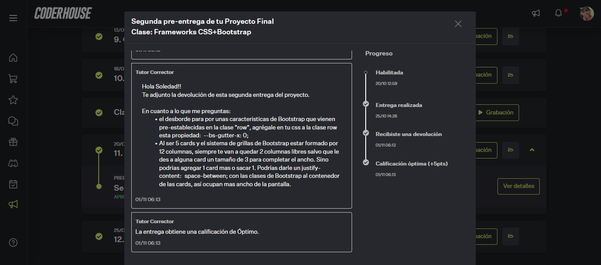

# Pre Entrega 1 y 2 : Desarrollo de una Pagina Web

## Primer entrega consiste en comenzar a armar la estructura inicial de tu proyecto integrador.

### DEMO: Fue entregado en formato ARCHIVO COMPRIMIDO y un  WIREFRAME FIGMA:.

## Temas vistos:

  1. Prototipado y conceptos básicos de HTML
  2. Primeros pasos con HTML
  3. Incluyendo CSS a nuestro proyecto
  4. CSS+Box Modeling

## Consigan a seguir:
       Deberás hacer entrega de tu proyecto donde aparezca: Wireframe/prototipo (wireframe de 
       todas tus páginas para vista mobile y desktop) + HTML (uso de etiquetas contenedoras, 
       etiquetas multimedia y etiquetas de texto) + CSS (con modificadores de texto, colores, 
       listas y box modeling).
       
## Objetivos:
       * Prototipar la web para tener una idea clara del resultado al que quieres llegar.
       * Maquetar la web: utilizar los tags, en especial los semánticos, para describir la 
         estructura de la web desde el código.
       * Crear un estilo inicial: comenzar a darle estilo básico a la web.

## Se debio entregar:

       * Prototipo de la web: versión que muestre cómo se verá el sitio cuando esté productivo.
       * Crear una estructura donde se organicen los elementos que van a estar en la web. 
         El nivel de detalle no es importante, sino más bien las posiciones que los elementos van a tener 
         y su tamaño aproximado.
       * Formato: Archivo PDF o de Imagen
       
       
       * Estructura inicial de la web en HTML: llevar el contenido a la estructura HTML haciendo uso de los
         tags que corresponden para el contenido a insertar. 
       * Incluyendo: etiquetas semánticas (tags semánticos de HTML5), contenido (agregar etiquetas que 
         van a servir para denotar dónde va a haber contenido como imágenes, párrafos y titulares) y 
         páginas (incluir las secciones del sitio ya maquetadas con la estructura propia de cada página.   
       * Formato: Archivos HTML
       
       
       * Estilo inicial de la web en CSS: comenzar a darle estilo básico a una página de su sitio web 
         (ej: index.html) aplicando con CSS las propiedades vistas hasta el momento para modificar textos, 
         encabezados, img, colores, background y box modeling.
       * El documento debe estar linkeado en las páginas del proyecto.
       * Formato: Archivo CSS (Flexbox no debe incluirse en esta entrega).

## NOTA OBTENIDA:

## Segunda Entrega consiste en continuar con el proyecto en avance de conceptos aprendidos

### DEMO:

### Temas Vistos:
    5. Flexbox
    6. GRIDS
    7. Animaciones, transformaciones y transiciones
    8. GIT y GITHUB
    9. Frameworks CSS+Bootstrap
    
## Formato:
       
        Link al repositorio en GitHub donde está hosteado el proyecto. Debe tener el nombre “PreEntrega2+Apellido”.

## Aspectos a incluir:
       - Hacer entrega del proyecto (dos páginas a elección) adaptado a la vista mobile y la vista desktop, agregando 
         animaciones. Para generar un diseño    responsive utilizar el Grid system de Bootstrap. 
       - La entrega se deberá cargar a un repositorio de GitHub público.
       - Objetivo:
                  * Realizar una estructura avanzada de la web.
                  * Efectuar el estilo avanzado de la web.
                  * Generar la carga en un repositorio en GitHub.
                  
## Estructura Avanzada de la web:

### Formato: Archivo HTML - CSS - Repositorio en GITHUB (link donde esta alojado el proyecto)

### Consigna:

       - HTML: Realizar una estructura del HTML prolija, limpia, fácil de leer. Agregar elementos HTML según la necesidad 
         de armar contenedores o elementos web determinados, basándose en el framework elegido y la documentación del mismo.
         
       - CSS: Crear archivos de CSS para darle estilo a la web. Agregar todas las propiedades CSS necesarias (transformaciones,
         animaciones y/o transiciones para otorgarle dinamismo a la web en elementos que tengan interacción con el usuario). 
         Hacer uso de selectores de CSS para poder darle estilo propio a los elementos que ya vienen con su propia identidad 
         del framework.
         
       - GitHub: Utilizar Git de forma correcta para versionar el proyecto. Hacer uso de GitHub para brindar acceso al 
         proyecto versionado.
       
### Se debe entregar:

       * Maquetado de la web: 
          - Maquetar dos páginas de tu sitio web. Para esto se puede usar bootstrap o Grids + Flexbox. 
          - Las estructuras deberán maquetar a la web en base al framework elegido, haciendo usos de clases utilitarias 
            para armar grillas, elementos web y estilos propios del framework, además del HTML de contenido.
            
       * Páginas: 
          - Todas las páginas deben tener el contenido estructurado y el estilo linkeado. 
          - Agregar las diferentes librerías de JavaScript y CSS pertinentes al framework.
          
       * Estilo avanzado: 
           - Se le mejorarán los elementos interactivos con variaciones en sus diferentes estados, ya sea de la mano de 
             transformaciones, transiciones y/o animaciones.
           - Estilo del Framework: no todos los elementos del framework van a tener una estética que condice con el sitio 
             en el que son implementados, por lo que se usará CSS para darles un estilo acorde.
           - Estructura de la web: uso de etiquetas no solo para armar contenido, sino para armar los elementos que van a 
             conformar el layout de la web, los contenedores, etc.
             
       * Repositorio:
           - Todos los archivos necesarios para visualizar correctamente la web.
           - Mostrar los commit usados para actualizar/versionar el código.

### Nota obtenida:

   
